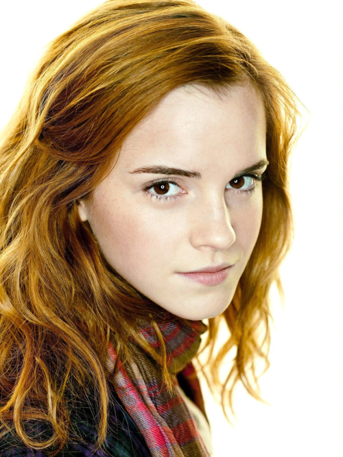
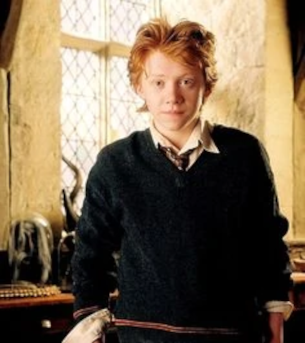
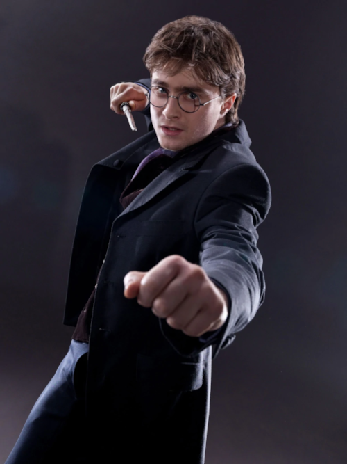
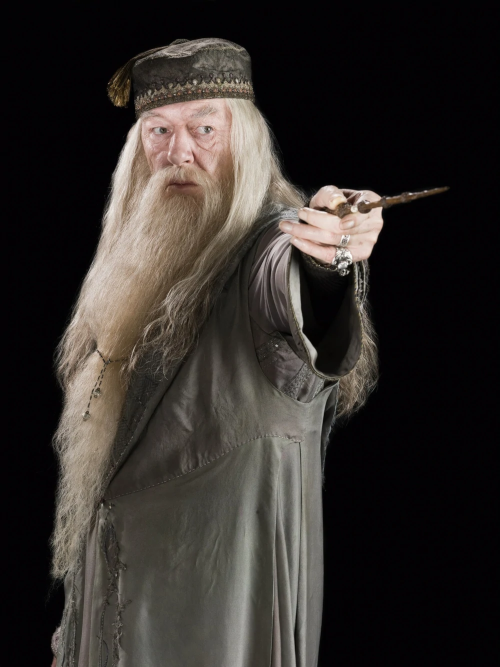
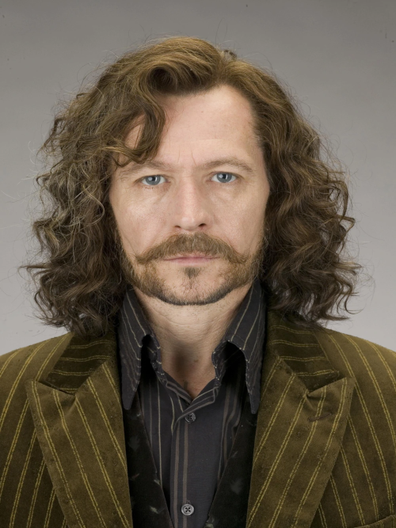

# Practica de modela 

La finalidad de la practica se centra en el modelado de 5 personajes
de la saga **Harry Potter** en la cual se busca destacar las características de los 
siguientes Magos:

- **Hermione Granger**

- **Ronald Weasley**

- **Harry Potter**

- **Albus Dumbledore**

- **Sirius Black**

En la practicas solo se contempla el modelado, dentro de los cuales se contemplará el constructor los getters y los setters.
